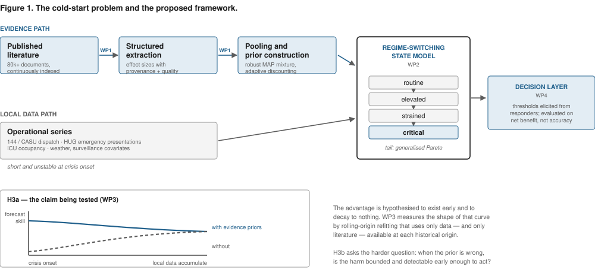

# 3. Objectives and hypotheses

*Figure 1 — the cold-start problem, the evidence-borrowing hypothesis and the evaluation ladder. See `figures/`.*

## Overall aim

To determine **whether, and under what conditions, published quantitative evidence can compensate for missing local outcome data at the onset of a health-system crisis — and whether the resulting forecasts improve decisions.**

The project is organised around one central hypothesis and three supporting questions. The supporting methods are deliberately subordinate to this test: extraction establishes whether the evidence can be trusted; the regime model provides a common representation of escalation; resilience indicators provide a complementary local signal; and decision analysis establishes whether forecast differences matter operationally.

---

## O1 — Make published quantitative evidence usable without hiding its uncertainty

Establish whether quantitative estimates can be extracted and pooled with an uncertainty structure that is sufficiently faithful for forecasting.

> **H1.** Automated extraction will systematically **underestimate between-study heterogeneity**, producing evidence-derived priors that are too concentrated; an explicit measurement-error layer will recover enough of the missing dispersion to construct usable prior distributions.

The directional prediction follows from the observed difficulty of numerical extraction and the dominance of omissions among reported extraction errors [Shankar 2026]. H1 is tested on point estimates, reported uncertainty, omissions and between-study dispersion. If the predicted overconfidence is absent, that is informative; if it occurs but cannot be corrected, the project establishes a boundary condition for using automated evidence in cold-start forecasting.

## O2 — Represent escalation in a form that separates state from the point forecast

Develop a parsimonious latent-state representation of health-system escalation that can accept evidence-derived priors and compare them fairly with weakly informative alternatives.

> **H2.** A latent regime representation improves probabilistic identification of transitions into elevated, strained and critical states relative to thresholding a point forecast, at matched false-alarm rates and with calibrated uncertainty.

Extreme-value modelling is used to represent the tail of the critical state. Critical-slowing-down indicators are treated as **supporting, theory-derived covariates** on transition dynamics, not as a separate project-level claim. Their incremental value is tested against level and trend information.

## O3 — Test the cold-start hypothesis and map failure

Determine whether evidence-derived priors improve forecasts when local outcome data are scarce, how their value decays as local data accumulate, and when they become harmful.

> **H3a.** Evidence-derived priors improve probabilistic forecast skill during the early phase of a crisis, with the advantage declining as local observations accumulate.

> **H3b.** Adaptive borrowing that discounts the evidence when prior–data conflict emerges performs at least as well as fixed borrowing and limits the degradation caused by a misspecified prior.

> **H3c.** Resilience indicators add predictive information beyond the evidence-derived prior and the local level/trend signal when the outcome history is short.

These hypotheses are tested through a pre-specified model ladder rather than by comparing only the final model with a weak baseline:

1. local seasonal/naive baseline;
2. established short-baseline surveillance method;
3. regime model with weakly informative priors;
4. the same regime model with fixed evidence-derived priors;
5. adaptive evidence borrowing with prior–data conflict monitoring;
6. adaptive borrowing plus resilience indicators.

The confirmatory comparison is the incremental value of steps 4–6 in the cold-start window. Once local data become sufficiently informative, the expected advantage of borrowing should disappear; the project therefore tests the **shape of the advantage over time**, not only one aggregate score.

## O4 — Establish whether predictive improvement is decision-relevant

Determine whether differences between modelling strategies change operational choices under explicitly elicited consequences.

> **H4.** Decision-analytic evaluation based on the losses and escalation thresholds of emergency responders can rank modelling strategies differently from generic statistical accuracy criteria, and the evidence-derived strategy is useful only when its predictive gain is large enough to cross a decision threshold.

Threshold elicitation, net benefit and retrospective counterfactual analysis are therefore downstream tests of value, not additional claims of methodological novelty. Prospective shadow-mode evaluation is a validation extension, not a prerequisite for the main scientific conclusion.

---

## Validation domains

The domains are chosen for **contrast in dynamics** and for the availability of information at crisis onset. They also reflect the disease-to-model classification developed in my GESICA work: respiratory transmission and common-source/environmentally mediated mechanisms together cover 32 of 76 notifiable diseases in that classification. The selection is therefore a coverage test rather than a convenience sample.

| Archetype | Role in the project | Dynamics | Data |
| --- | --- | --- | --- |
| **Respiratory epidemic** | Core validation | Transmissible, multi-wave, seasonal | COVID-19 / influenza operational and surveillance series |
| **Heatwave** | Core generalisation test | Environmental, short and sharply peaked | MeteoSwiss plus emergency-demand data |
| **Waterborne outbreak** | Year-4 extension | Common-source / environmentally mediated | Geneva legionellosis linked to installations |

The first two domains carry the core claim. The third tests whether the framework can cross a substantially different crisis mechanism; its omission does not invalidate the main cold-start result.

## What the project does not claim

- It does **not** aim to outperform established forecast hubs in the data-rich regime.
- It does **not** assume that literature-derived priors are beneficial.
- It does **not** claim that critical slowing down will provide a universal early-warning signal.
- It does **not** promise a deployed clinical alarm system by month 48.

The central scientific contribution is narrower: **a rigorous answer to whether accumulated quantitative evidence can earn a formal role in forecasting before local outcome data become informative, together with a map of when it should not be trusted.**
