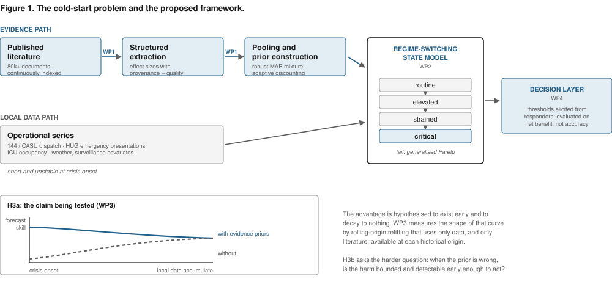

## 2.3 Detailed research plan

### 2.3.1 Objectives and hypotheses

To determine **whether, and under what conditions, published quantitative evidence provides useful information when local outcome data are insufficient at the onset of a health-system crisis, and whether the resulting forecasts change decisions.**

**One central hypothesis, H3a**; all else is subordinate:

| | Role | Statement |
| --- | --- | --- |
| **H1** | Validation | Can the evidence be trusted enough to use? |
| **C2** | Adequacy criterion | Is the state representation fit to compare borrowing in? |
| **H3a** | **Central hypothesis** | **Does systematically extracted evidence improve cold-start forecast skill?** |
| **H3b** | Robustness | Is adaptive borrowing safe when the prior is wrong? |
| **H3c** | Secondary channel | Do resilience indicators add information beyond the evidence? |
| **H4** | Decision value | Is the gain large enough to change an operational choice? |

*Figure 1: cold-start problem, evidence pipeline, model library with automated selection, living update loop.*

#### O1: Make published evidence usable without hiding its uncertainty

> **H1.** Automated extraction will systematically **understate the dispersion of the evidence-derived distribution** (reported within-study uncertainty and between-study heterogeneity), producing priors that are too concentrated; an explicit measurement-error layer will recover enough of the missing dispersion to construct usable priors.

Omissions dominate reported extraction errors [Shankar 2026]; whether they systematically shrink dispersion is what H1 tests, and if the loss is uncorrectable, the project establishes a boundary condition. The evidence target spans four object classes (parameter values; predictor variables and lags; model forms; outcome and threshold definitions: T1.1); H1 is tested on the quantitative core, and classes 2 to 4 are validated externally against published syntheses (T1.2).

#### O2: Represent escalation in a form that separates state from the point forecast

> **C2, model adequacy criterion.** The latent-state representation must yield **identifiable** parameters and **calibrated** escalation-state probabilities at matched false-alarm rates. Its role is the common state representation in which borrowing strategies are compared, not a claim that regime switching generally beats thresholding a point forecast.

T2.1's identifiability study and T3.3's calibration checks either establish adequacy or trigger the ordinal fallback; either outcome leaves H3a intact. Extreme-value modelling covers the critical tail; critical-slowing-down indicators are **supporting covariates**.

#### O3: Test the cold-start hypothesis and map failure

> **H3a.** An evidence-informed forecasting configuration (evidence-derived priors, variable sets and model forms) improves probabilistic forecast skill during the early phase of a crisis, with the advantage declining as local observations accumulate.

> **H3b.** Adaptive borrowing that discounts the evidence when prior–data conflict emerges is
> **non-inferior** to fixed borrowing under well-specified priors, within a pre-specified margin
> Δ on the CRPS skill score, and is **superior** to fixed borrowing under deliberately
> misspecified priors.

Δ is fixed at the second registration point as a registered fraction of the minimal relevant H3a improvement: a maximum acceptable loss, not a simulation convenience.

> **H3c.** Resilience indicators add predictive information beyond the evidence-derived prior and the local level/trend signal when the outcome history is short.

**Primary confirmatory comparison (one, stated once):** the **evidence-informed champion** against the **local-only champion**, both produced by the identical pre-registered automated procedure (T3.3), by **CRPS skill score**, over the pre-specified cold-start window, **on respiratory episodes only**. Heat repeats the identical contrast as a **sequential generalisation test**, run only if the respiratory test is met; the fixed order controls the family-wise error rate. The **shape of the advantage over elapsed local data** is reported: it should decay to nothing. The primary test values the whole evidence-informed configuration; the prior component's own contribution is isolated by registered secondary contrasts within the same model family.

#### O4: Establish whether predictive improvement is decision-relevant

> **H4.** Decision-analytic evaluation under the losses and escalation thresholds of emergency responders can rank modelling strategies differently from generic accuracy criteria; the evidence-derived strategy is useful only when its gain crosses a decision threshold.

#### Scope: three Geneva crisis archetypes, fixed for the grant

**COLDSTART's real-world scope is three health-system crisis archetypes, and no more.**
(1) **Respiratory epidemics**: SARS-CoV-2, influenza and RSV, syndromically overlapping and
surveilled together in Switzerland, carry the primary confirmatory test.
(2) **Environmental heat events** carry the sequential generalisation test, with **air
pollution (ozone, PM10) as co-exposure and effect modifier**, not a separate crisis domain.
(3) **Waterborne outbreaks**: Geneva legionellosis, the year-4 contrasting extension (T3.5).
The domains are fixed for the project; further data serve benchmarking and sensitivity
analyses only; no fourth operational domain is required.
Both arms score **the same quantity, built the same way**: daily emergency demand from the
CASU-144 series, restricted to the archetype's cause classes (T3.0): respiratory-related
demand for epidemics; **heat-sensitive demand** for heat, Swiss evidence placing heat
effects in dehydration, renal and psychiatric admissions, with a weak respiratory effect at
older ages [Schulte 2024; Ragettli 2019].

#### What the project does not claim

It does **not** aim to outperform forecast hubs in the data-rich regime, assume literature-derived priors are beneficial, claim critical slowing down as universal, or promise a clinically steering alarm by month 48: the dashboard runs strictly in observation mode. The contribution: **whether accumulated quantitative evidence can earn a formal role in forecasting before local outcome data become informative, and a map of when it should not be trusted.**
