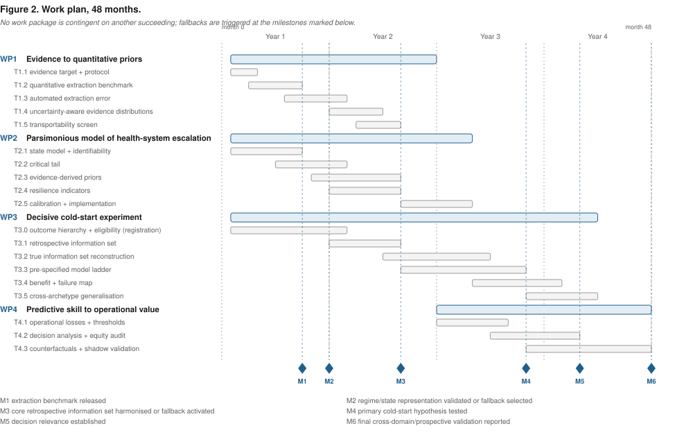

# 4. Detailed research plan

Four work packages over 48 months. WP1 and WP2 run in parallel from the start and are
**deliberately independent**: WP2's methodological development does not wait on WP1's extraction
results, and WP3 can be executed with weakly informative priors if WP1 concludes that
evidence-derived priors are unusable. That negative result would itself answer O1 and O3.

Staffing: PI `[[Erol Orel, XX%]]` and one doctoral researcher (`[[months]]`). The PI executes
WP2 personally — it is the methodological core and the source of the project's distinctiveness.

---

## WP1 — From published evidence to quantitative priors *(M1–M24)*

**Question.** Can quantitative parameters be extracted from the literature reliably enough to
serve as priors, and what is the structure of the error?

### Tasks

**T1.1 — Define the extractable parameter classes (M1–M4).**
Fix in advance, with justification, the classes in scope: weather–demand associations, surge
magnitudes (peak-to-baseline ratios), transmission parameters, length-of-stay and occupancy
distributions. Register the extraction protocol before running it.

**T1.2 — Build a gold-standard benchmark (M3–M10).**
Two independent expert extractors manually extract the target parameters from a stratified random
sample of `[[n ≈ 300–500]]` publications from the corpus, with adjudication of disagreements,
stratified by parameter class, reporting quality and venue. No such reference set exists for
quantitative extraction, so the benchmark is a deliverable in its own right and reusable by
others.

**T1.3 — Characterise automated extraction against the benchmark (M8–M16).**
Evaluate the platform's extraction against the gold standard: agreement on point estimates, on
reported uncertainty, and — the substantive test of H1 — whether the *dispersion* of extracted
estimates reproduces that of manually extracted ones. Decompose error by parameter class,
reporting completeness and study design, and assess sensitivity to the underlying language model,
since the behaviour must not be an artefact of one version.

**T1.4 — Model extraction error, construct corrected priors (M14–M22).**
Represent extraction error as an explicit measurement-error layer above the evidence synthesis, so
a prior carries both between-study heterogeneity and extraction uncertainty. Compare pooling
strategies: naive inverse-variance, quality-weighted (as implemented), meta-analytic-predictive,
power-prior discounting.

**T1.5 — Transportability assessment (M18–M24).**
For each parameter class, assess formally whether the study populations support transport to
Geneva: characterise effect-modifier distributions and, where transport is unsupported, quantify
the resulting bias rather than assuming it away.

### Sample size for the benchmark

The benchmark is sized to detect the H1 bias, not to estimate accuracy precisely. The quantity of
interest is the ratio of extracted to reference between-study variance; simulation under plausible
values (`[[τ² range]]`) fixes the publications per parameter class needed to detect a ratio of
`[[0.7]]` or lower at 80% power. The effect should be detectable in a modest sample: numerical
extraction accuracy of 47–88% with omissions dominating the error budget [Shankar 2026] implies
non-random attrition of exactly the quantities carrying dispersion information, and omission
correlated with reporting quality — plausible, since poorly reported studies are harder to extract
from — produces systematically narrow pooled distributions. That is the mechanism T1.3 tests.

**Deliverables.** D1.1 gold-standard benchmark dataset (open). D1.2 characterisation of automated
extraction error, with correction. D1.3 open library converting corpus queries into prior
distributions with documented provenance.

**Risk.** Manual extraction is slow and expensive. *Mitigation:* sample size is set by the
precision needed to detect the H1 bias, not by ambition, and justified by simulation in T1.1. If
expert time binds, narrow to two parameter classes and say so.

---

## WP2 — Regime-switching forecasting with an extreme-value tail *(M1–M30)*

**Question.** Does representing health-system state as a latent regime process, rather than as a
threshold on a point forecast, anticipate escalation better?

### Tasks

**T2.1 — Specify the state process (M1–M8).**
A Bayesian hierarchical **Markov regime-switching model** over the joint series of emergency call
volume, emergency department presentations and intensive care occupancy.

Structurally: an unobserved state `S(t) ∈ {routine, elevated, strained, critical}` follows a
first-order Markov chain whose transition intensities depend on covariates — temperature and heat
indices, epidemic indicators, calendar and holiday structure — through a multinomial logit link.
Conditional on the state, each observed series follows a count or continuous distribution with
state-dependent level, trend and dispersion, with the three series sharing the state process and
retaining series-specific emission parameters. This is the joint structure that distinguishes the
model from existing two-state epidemic/non-epidemic HMMs on a single surveillance series
[Le Strat 1999; Watkins 2009]: escalation is a property of the health system, observed through
three imperfect and differently lagged windows onto it.

Estimation by MCMC with forward filtering–backward sampling, or variational approximation if
dimension requires it. **Identifiability is the live methodological risk**, not an afterthought:
ordering constraints on regime means resolve label switching, but weak regime separation can leave
the posterior effectively multimodal. T2.1 therefore concludes with a simulation study
establishing the regime separation and series length required for reliable recovery, run **before**
any application to real data, and reported whatever it shows.

**T2.2 — Tail behaviour (M6–M14).**
The critical regime is rarely observed, so the regime model alone estimates it poorly. Complement
it with a peaks-over-threshold generalised Pareto representation of exceedances, coupled so that
the probability of entering the critical regime is informed by the tail model rather than by a
handful of observed transitions. Threshold selection by stability diagnostics, with sensitivity
reported rather than a single chosen value.

**T2.3 — Prior structure (M10–M20).**
Define how WP1's evidence-derived distributions enter the model: as priors on covariate effects
(the weather–demand associations), on regime-specific means (surge magnitudes), and on transition
intensities (escalation and recovery rates). The mechanism is the robust meta-analytic-predictive
construction [Schmidli 2014] — a mixture of the evidence-derived component with a weakly
informative one, whose mixture weight is estimated rather than fixed. Prior–data conflict then
resolves itself: when the literature and the local data agree, the informative component dominates
and the effective sample size gain is real; when they diverge, weight shifts to the vague
component automatically.

This is precisely the machinery H3b tests, and it is why H3b is stated as a claim about
**bounded and detectable** harm rather than about no harm. The theoretical protection is
well established in clinical trials, where historical borrowing is routine. Whether it holds when
the "historical" information is a machine-extracted synthesis of a heterogeneous literature,
rather than a small number of curated control arms, is an open question — and it is the question
that decides whether any of this is deployable.

Power-prior discounting [Ibrahim 2000] and commensurate priors [Hobbs 2011] are implemented as
comparators, so the choice of borrowing mechanism is evaluated rather than assumed.

**T2.4 — Baselines and comparators (M12–M22).**
Pre-specify the comparison set so evaluation cannot be tuned after the fact: seasonal naive;
Farrington-style detection, including a variant designed for short baselines [Yoneoka 2021];
SARIMA/Prophet with thresholding; gradient boosting with weather features; a compartmental
patient-flow model of the kind hospitals actually use; an ensemble; and the regime-switching model
under weakly informative priors — the last isolating the contribution of the priors from that of
the representation.

**T2.5 — Resilience indicators as transition covariates (M8–M18).**
Compute critical-slowing-down indicators — rolling variance, lag-1 autocorrelation, and the
further resilience statistics catalogued in [Southall 2021] — on the detrended operational series,
and enter them as covariates on the transition intensities of T2.1. Two things make this more than
feature engineering. First, the indicators are **theoretically motivated**: dynamical systems
theory predicts their behaviour approaching a transition, so a null result is interpretable rather
than merely negative. Second, they are computable **from short windows of recent data**, so they
supply cold-start information by a route entirely independent of the literature priors — which is
what H3c tests. Sensitivity to window length, detrending choice and the known false-positive
behaviour of these indicators is characterised rather than tuned away.

**T2.6 — Conformal calibration layer (M20–M28).**
Wrap the predictive distributions in a conformal layer with distribution-free finite-sample
coverage, using variants valid under temporal dependence and distribution shift. This is the
safety net for H3b: if an evidence-derived prior is badly wrong, Bayesian credible intervals
inherit the error, whereas conformal intervals retain their coverage guarantee. For a decision
layer this is the difference between a threshold that is unsafe when the model is misspecified and
one that is not.

**T2.7 — Implementation (M18–M30).** Documented, open reference implementation, integrated with
the existing platform.

**Deliverables.** D2.1 model specification and identifiability analysis. D2.2 open implementation.
D2.3 methodological paper on regime-switching for health-system surge, combining theory-derived
resilience indicators with evidence-derived priors under conformal calibration.

**Risk.** Regime models can be weakly identified when regimes are not well separated.
*Mitigation:* simulation study in T2.1 establishing the separation and series length needed for
recovery, run **before** application to real data; if the diagnostics fail, fall back to an
ordinal state-space formulation, which is weaker but identifiable. Report this honestly either
way — a negative identifiability result is a genuine contribution to a literature that mostly
does not check.

---

## WP3 — Retrospective cold-start evaluation *(M12–M42)*

**Question.** Do evidence-derived priors improve forecast skill when local data are scarce, and
when do they mislead?

### Tasks

**T3.1 — Assemble the retrospective operational record (M12–M20).**
`[[HUG emergency presentations; 144/CASU call and dispatch records; ICU occupancy; MeteoSwiss;
cantonal and federal surveillance — specify years and granularity once agreements are in place.]]`
Harmonise into a reproducible pipeline with **quantified completeness**, including a
**reporting-delay model**: operational counts are right-truncated, and recent days fill in over
subsequent days, so a model fitted to raw recent data reads truncation as decline — the wrong
signal precisely at surge onset. The delay distribution is estimated jointly with the epidemic
curve by established nowcasting methods [Höhle 2014; McGough 2020] rather than assumed.

Incompleteness is expected and modelled rather than caveated: our review reports completeness of
roughly 52–70% across prehospital record types, some variables missing in over 90% of records
[Edjinedja 2026]. Working at **daily aggregate** level rather than record level substantially
reduces exposure — one reason the data request is scoped that way. Residual missingness enters the
observation model explicitly and its mechanism is characterised rather than assumed ignorable:
reporting completeness that itself degrades with system strain would bias exactly the transitions
this project aims to detect.

**T3.2 — Rolling-origin evaluation respecting the true information set (M18–M32).**
The methodological heart of the evaluation. For each historical crisis onset, refit at successive
origins using **only** data available at that moment — including only literature published before
that date, which the corpus's indexing makes enforceable. Forecast forward at operationally
relevant horizons (`[[7, 14, 28 days]]`). This constraint is what makes the cold-start claim
meaningful and it is routinely violated in retrospective forecasting studies.

**T3.3 — Skill and calibration (M24–M36).**
Evaluate with strictly proper scoring rules — continuous ranked probability score and logarithmic
score [Gneiting 2007] — plus calibration assessed by probability integral transform histograms
and interval coverage, and sharpness conditional on calibration. Report skill **as a function of
elapsed time since onset**, which is the quantity H3a is about; a single aggregate score would
average away the effect being tested, and the shape of that decay curve — how many weeks of local
data are worth a literature prior — is itself the practically useful result.

Uncertainty on skill differences by block bootstrap over episodes, respecting temporal dependence.
The confirmatory comparisons are registered in advance; everything else is labelled exploratory.

**T3.4 — Failure analysis (M28–M38).**
Deliberately adversarial: identify episodes where priors degraded performance, characterise them,
and test whether divergence was detectable early from prior–data discrepancy diagnostics (H3b).
Includes stress tests with deliberately misspecified priors — a different pathogen, health system
or era — to bound the damage.

**T3.5 — Waterborne archetype (M34–M42, extension).** Apply the framework to Geneva legionellosis
using the linked case–installation data. Scoped as an extension: it strengthens generalisability
and its omission does not invalidate O3.

**Deliverables.** D3.1 reproducible evaluation pipeline. D3.2 the cold-start result. D3.3 failure
and stress-test analysis.

**Risk — the project's principal one.** Clinical operational data may be delayed or refused.
*Mitigation, in order:* (i) agreements initiated before the grant starts, with supporting letters
in this application; (ii) infrastructure hardening completed in advance so data-protection review
is not the obstacle; (iii) **fallback** — the cold-start hypothesis can be tested on open
surveillance series (federal and cantonal notifications, Sentinelles, European surveillance) plus
the Legionella linkage already under ethics. A weaker test, since it loses the operational
endpoint, but a real one: the project cannot fail outright on data access.

---

## WP4 — Decision relevance and prospective evaluation *(M24–M48)*

**Question.** Would this change what anyone does?

### Tasks

**T4.1 — Threshold elicitation (M24–M32).**
Structured elicitation following the **SHELF** protocol — individual elicitation, facilitated
discussion, then a distribution representing a rational impartial observer — with emergency
physicians, dispatch supervisors and hospital capacity managers `[[HUG, 144/CASU — n ≈ 15–20, purposively sampled across roles]]`. The instrument is
built around actions rather than probabilities: for each escalation level, what becomes available
that was not available before, what it costs to do, what it costs to do unnecessarily — including the cost to *future
compliance*, since an alarm that cries wolf degrades response to the next one — and what it costs
to omit. Threshold probabilities are then derived from the elicited cost ratios
in the standard decision-analytic way [Vickers 2006], rather than asked for directly — people are
poor at stating probability thresholds and much better at comparing consequences.

Elicit individually, then present the group distribution and re-elicit, recording both rounds.
Disagreement between roles is a finding, not noise: if dispatch supervisors and intensive care
managers hold materially different loss structures, no single threshold serves both.

**T4.2 — Consequence-weighted evaluation (M30–M40).**
Re-evaluate WP3's comparisons under the elicited loss structure using net benefit and
decision-curve analysis. Test H4 by comparing elicited thresholds with statistically optimal ones
and determining whether the ranking of methods changes. Include a value-of-information calculation
— what a perfect forecast would be worth under the elicited losses — as an upper bound on the value
of further methodological work.

**T4.5 — Prospective shadow-mode deployment (M36–M48).**
Run the framework prospectively alongside routine operations, issuing forecasts that are recorded
but **not** used for decisions. Compare prospective skill with retrospective estimates — the gap
between the two is one of the most useful and least reported quantities in this literature.

**T4.3 — Equity audit of forecasts and thresholds (M32–M40).**
Escalation decisions and prehospital records carry the structural inequalities of the system that
produced them, and a model trained on historical escalation reproduces them by construction — a
concern our review identifies as paramount for AI in emergency services [Edjinedja 2026]. Assess
whether forecast skill and elicited thresholds differ systematically across `[[age, sex,
neighbourhood deprivation, language]]` strata available in the aggregate data. A system well
calibrated on average and poorly calibrated for one group is not fit for deployment.

**T4.4 — Retrospective counterfactual analysis (M36–M44).**
For each historical episode, ask the question the partners actually care about: *had escalation
been triggered when the model signalled it rather than when it in fact occurred, what would have
changed?* Couple the estimated regime trajectories to a simple capacity model to produce
counterfactual bed-days, diverted transports and unmet demand, with uncertainty propagated. This
is stress testing in the sense I used it in quantitative finance — asking what a decision rule
would have done under histories that did occur — and it converts an abstract skill improvement
into a quantity a hospital director recognises. Stated with appropriate caution: these are
model-based counterfactuals under explicit assumptions, not causal estimates of a policy effect,
and the sensitivity of each conclusion to those assumptions is reported.

**Deliverables.** D4.1 elicited loss structure and thresholds. D4.2 decision-analytic evaluation
with equity audit. D4.3 counterfactual analysis of historical episodes. D4.4 prospective
validation.

**Risk.** Shadow deployment may not be authorised, or the period may contain no crisis.
*Mitigation:* shadow mode involves no clinical action and is the least demanding deployment form;
if refused, the earlier tasks stand alone and the claims are retrospective, stated rather than
concealed. T4.4 is scoped as calibration validation in routine conditions, not as a crisis test.

---

## Dependencies, milestones and timing

*Figure 2 — work plan over 48 months, with the milestones at which fallbacks are triggered.*

**No work package is contingent on another succeeding.** WP2 proceeds under weakly informative
priors if WP1 returns a negative result; WP3 proceeds on open surveillance data if operational data
are delayed; WP4's core analysis is retrospective and needs no deployment. Serial dependency on an
uncertain result is the standard feasibility objection to four-year plans, and the design removes
it.

| Milestone | Month | Criterion |
| --- | --- | --- |
| M1 — Extraction benchmark complete | 10 | D1.1 released |
| M2 — Regime model identifiable in simulation | 12 | Recovery demonstrated; else fallback triggered |
| M3 — Operational data in place | 20 | Agreements executed and data harmonised; else fallback triggered |
| M4 — Cold-start result | 32 | H3a tested with pre-specified comparators |
| M5 — Decision-analytic evaluation | 40 | H4 tested |
| M6 — Prospective validation | 48 | T4.5 reported |

## Methods, data protection and reproducibility

All analyses in R and Python, version-controlled, with a registered analysis plan for the
confirmatory comparisons in WP3. Clinical data processed under `[[CCER approval — new submission
with the PI as applicant]]` in the University of Geneva secure environment. Code released open
source; the extraction benchmark released openly; clinical data not shareable, with synthetic
equivalents provided for reproducibility.

---

## Consolidated risk register

| # | Risk | L | I | Mitigation | Fallback trigger |
| --- | --- | --- | --- | --- | --- |
| R1 | Operational data delayed or refused | M | **H** | Agreements pre-award with letters attached; hardening done in advance; WP3 fallback to open surveillance plus the Legionella linkage | M20 missed |
| R2 | Regime model weakly identified | M | H | Simulation study in T2.1 before application; fall back to an ordinal state-space form | M12 recovery poor |
| R3 | Extraction too unreliable for priors | M | L | A result, not a failure: answers O1, settles O3 negatively; WP2–3 proceed under weak priors | T1.3 outcome |
| R4 | Too few critical-regime episodes | **H** | M | Extreme-value tail model (T2.2) exists for this; pool across series and archetypes; power stated in advance | Known at T3.1 |
| R5 | Shadow deployment refused, or a quiet period | M | L | T4.2 stands alone; T4.5 scoped as calibration validation, not a crisis test | M36 |
| R6 | Doctoral recruitment delay | L | M | WP2 is PI-executed; WP1 benchmark design proceeds | M3 |
| R7 | Overlap with GESICA or Horizon | L | M | Delimitation in §5, declared in mySNF; outputs inferential, theirs infrastructural | Ongoing |

R4 is intrinsic rather than circumstantial: the critical regime is rare by definition, and no
amount of data collection within four years changes that. It is why the design imports extreme
value methods and resilience indicators rather than relying on the regime model alone, and why
evaluation is decision-analytic rather than accuracy-based.

## Expected outputs

Four to six papers, plus two open resources — the extraction benchmark (M10–M14) and the
regime-switching software (M24–M30). Sequence: extraction benchmark and error characterisation
(M14–M24); methods paper on the regime framework (M24–M30); the cold-start result (M32–M38);
decision-analytic and counterfactual evaluation (M40–M44); prospective validation (M46–M48). The
doctoral researcher is first author on the benchmark and evaluation work.
`[[Adjust to field norms — credible rather than maximal.]]`
