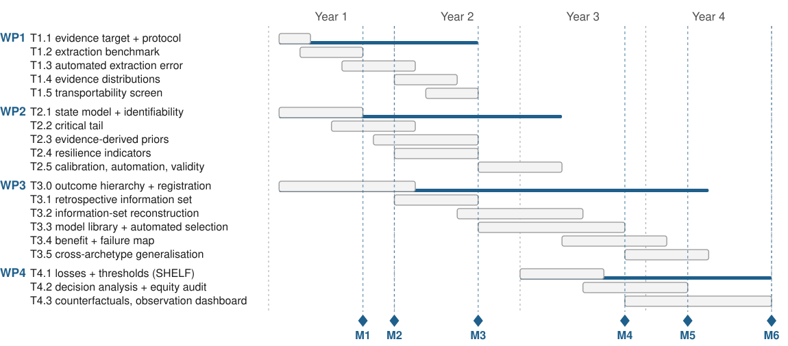

## 2.4 Schedule and milestones

*Figure 2: work packages, tasks and milestones over 48 months. See `figures/`.*

**Who does what.** I execute WP2 and WP3's confirmatory evaluation design personally, and lead
WP1's protocol, WP3's analysis and WP4's decision work. One **scientific/technical collaborator**
(support personnel, 50% over 48 months) is requested, justified by three labour-intensive, fully
specified tasks the PI cannot absorb: second independent extractor for T1.2's benchmark, the
T3.1–T3.2 harmonisation and rolling-origin pipeline, and the reproducibility engineering behind
D1.1 and D3.1. No other personnel are requested. Collaborators contribute defined inputs: DS4DH
the biomedical NLP for T1.3; HUG and CASU-144 the data access and T4.1 elicitation.

The design avoids a serial chain in which one uncertain result stops the project: WP2 falls back to weakly informative priors if WP1 finds extraction inadequate, WP3 to open surveillance data if operational access is delayed, and WP4's decision analysis is retrospective, independent of prospective deployment.

**What the data fallback costs.** Open surveillance series are not the same outcome as emergency-system demand. Falling back **preserves the methodological test but narrows the outcome claim**, from operational demand to routinely observed crisis indicators, and turns most of WP4's decision analysis illustrative. Hence the agreements are a pre-award action, not a risk to manage later.

| Milestone | Month | Criterion |
| --- | ---: | --- |
| M1 | 9 | Extraction benchmark released |
| M2 | 12 | Regime/state representation passes identifiability criteria, or fallback selected |
| M3 | 20 | Retrospective information set harmonised, or open-data fallback activated |
| M4 | 34 | Primary cold-start hypothesis tested on the pre-specified ladder |
| M5 | 40 | Decision relevance established |
| M6 | 48 | Cross-domain and prospective validation where feasible |
